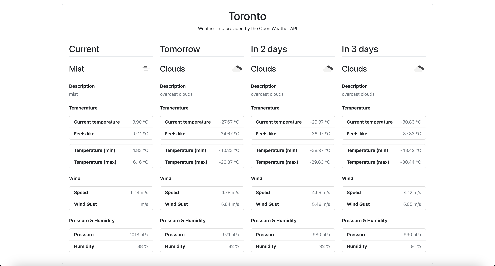
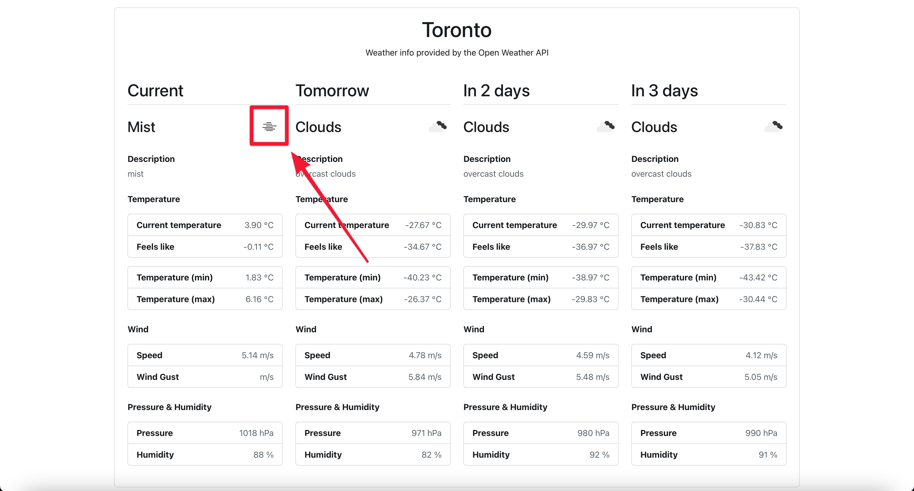
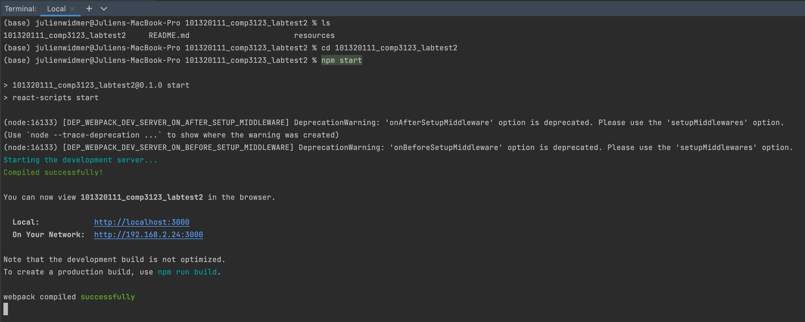
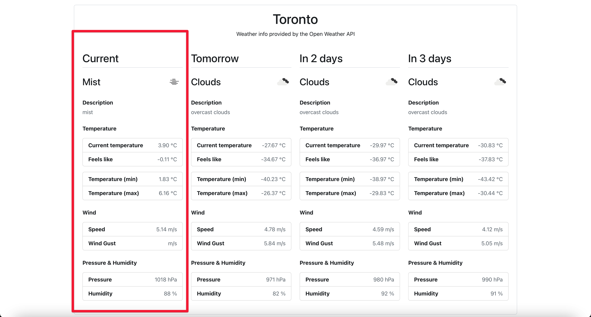
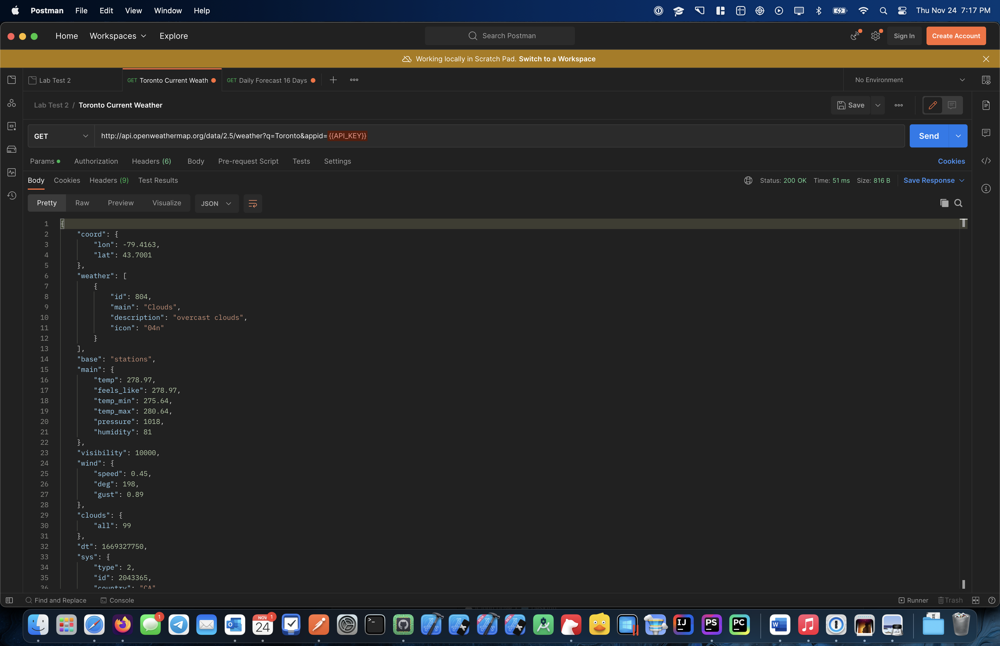
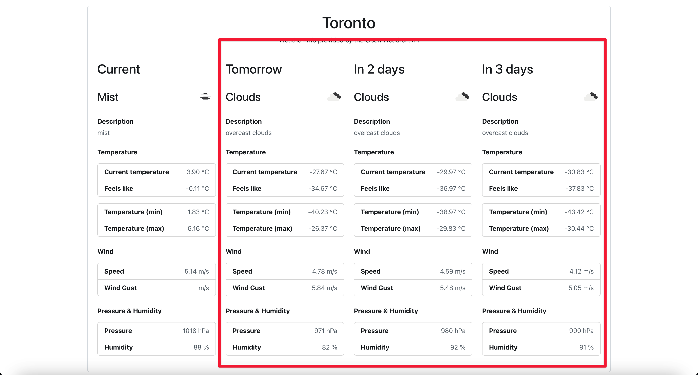
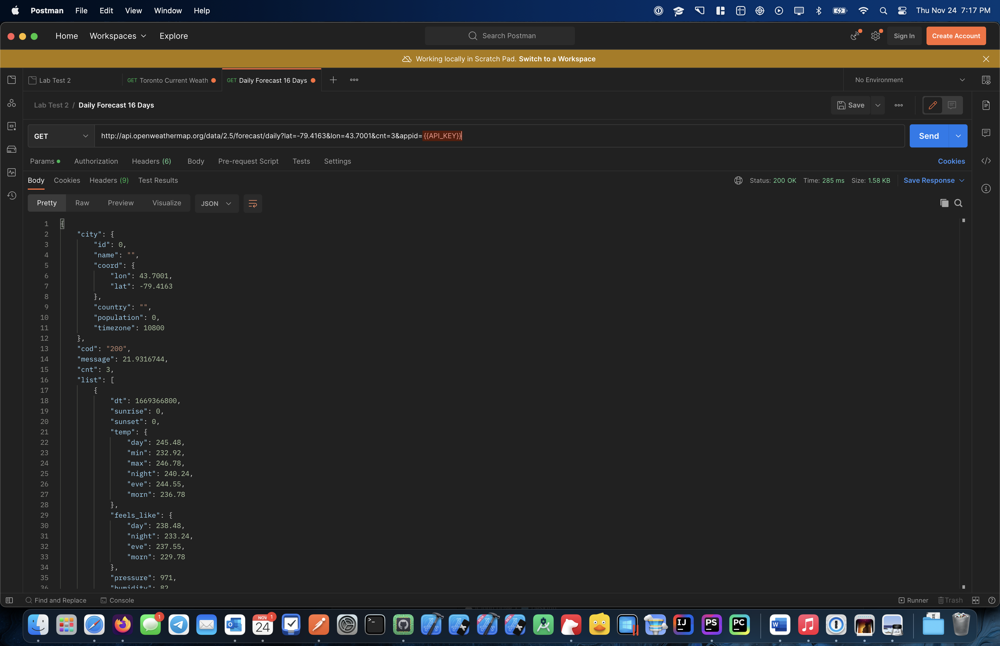

# COMP 3123 - Lab Test 2

Use the [Open Weather API](https://openweathermap.org/) to retrieve and display weather forecast for Toronto, ON.

## Notes
* The Postman collection is available in the resources folder `./resources/LabTest2.postman_collection`
* Screenshots of the app, Postman and outputs are available in the screenshots folder `./resources/screenshots/*.png`

---

## Steps to Setup

1. Install dependencies

```bash
npm install
```

2. Run React app

```bash
npm start
```

You can browse the app at <http://localhost:3000>

---

## Instructions

1. Replace `{{API_KEY}}` with your API key inside `TorontoCurrentWeather.js` (line 12) and
inside `TorontoFutureWeather.js` (line 10).

---

# Preview of the app


## Usage of the weather icons provided by the Open Weather API


## Terminal Output
The app runs with 2 deprecation warnings and 0 errors.


---

# Part 1 - Current Weather Forecast
Displays the current weather forecast.

This component is coded in `TorontoCurrentWeather.js` inside the `components` folder and uses the:
-  [Current Weather Data - Open Weather API](https://openweathermap.org/current)


## Postman response input
Note: The API was removed from the parameters in Postman AFTER performing the request and BEFORE taking the screenshot.


---
# Part 2 - Future Weather Forecast
Displays the weather forecast for the next 3 days.

This component is coded in `TorontoFutureWeather.js` inside the `components` folder and uses the:
- [Daily Forecast 16 Days - Open Weather API](https://openweathermap.org/forecast16)


## Postman response input
Note: The API was removed from the parameters in Postman AFTER performing the request and BEFORE taking the screenshot.

